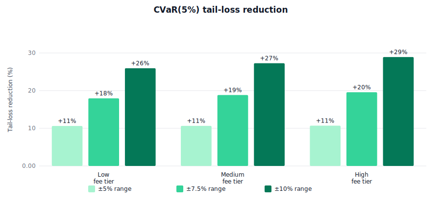

# 8. Empirical Results

This section documents the backtesting methodology and results obtained by running the protocol over real SOL/USDC historical price data sourced from the Birdeye API. All numbers below are from a **fresh backtest under the signed-swap payoff** (Definition 2.2, `Π = V(S_0) − V(clamp(S_T, p_l, p_u))`).

> **Snapshot: 2026-04-22.** All numeric tables, figure captions, and narrative claims in this section correspond to a specific reproducible run: backtest window **2025-04-17 → 2026-04-16** (52 weeks), realized σ₃₀d = **57.4%**, GH-quadrature pricing, concentration factors `c = {2.03, 1.45, 0.87}` for widths `{±5%, ±7.5%, ±10%}` respectively (most recent live-orca Phase-2 measurements). The raw data dump is at [charts/BACKTEST_DATA.md](charts/BACKTEST_DATA.md) and is regenerated in-process by `yarn generate-charts`, which also produces the four SVG charts cited in §8.2 and §8.5. Re-running the pipeline on a later day will shift the window forward and produce slightly different numbers; the **structural and directional conclusions** stated here are stable across runs (the hedge always wins on CVaR, always reduces std by 22–41% depending on width, etc.) but the **exact percentages** are regime-dependent.

## 8.1 Experimental Setup

### 8.1.1 Data Source

All price data is sourced from the **Birdeye DeFi API** (`public-api.birdeye.so/defi/ohlcv`), querying the native SOL token (`So11111111111111111111111111111111111111112`) on Solana.

- **Weekly prices:** Daily OHLCV candles over 52 weeks, sampled every 7th close to produce weekly entry/settlement prices.
- **Volatility estimation:** 30 days of 15-minute candles (2,880 candles), used to compute 30-day and 7-day annualized realized volatility via the standard log-return standard deviation method (see Section 5.1).
- **Date range:** 2025-04-17 to 2026-04-16 (52 usable weeks for the snapshot in this document; `yarn generate-charts` refreshes this window to end today on each run).

### 8.1.2 Position Parameters

| Parameter | Value | Rationale |
|-----------|-------|-----------|
| Liquidity `L` | 10,000 | Produces a position value of \~\$11,000 at \$150 SOL, large enough for meaningful premium/payout magnitudes |
| Entry price `S_0` | Real weekly close from Birdeye | Varies each week (\~\$82–\$205 over the period) |
| Lower bound `p_l` | `S_0 × (1 − widthBps/10000)` | Barrier equals lower range bound |
| Upper bound `p_u` | `S_0 × (1 + widthBps/10000)` | Symmetric around entry |
| Widths tested | ±5% (500 bps), ±7.5% (750 bps), ±10% (1000 bps) | Covers narrow to wide range strategies |

**Reference values at `S_0 = \$125.30` (first week's price), ±10%:**

- Position value `V(S_0) ≈ \$10,920`
- Downside cap `Cap_down = V(S_0) − V(p_l) ≈ \$816`
- Upside cap `Cap_up = V(p_u) − V(S_0) ≈ \$235` (note: `Cap_up < Cap_down` by concavity of `V`, Proposition 2.1)
- Lower bound `p_l ≈ \$112.77`; Upper bound `p_u ≈ \$137.83`

### 8.1.3 Protocol Parameters

| Parameter | Value | Notes |
|-----------|-------|-------|
| RT deposit | \$5,000,000 | Large pool to avoid utilization constraints during backtest |
| Max utilization `u_max` | 30% (3000 bps) | Standard governance setting |
| Protocol fee `φ` | 1.5% (150 bps) | Applied to premium; flows to protocol treasury |
| Markup `m_vol` | 1.08 | `max(1.05, IV/RV)` with IV/RV = 1.08 |
| P_floor | 1% of `V(S_0)` | Dynamic: recalculated each week based on entry price |
| Fee split rate `y` | 10% | Baseline; optimized in two-sided viability analysis |

### 8.1.4 Volatility Regime

From the Birdeye 15-minute candle data (30-day window):

| Metric | Value |
|--------|-------|
| 30-day realized volatility | 67.0% annualized |
| 7-day realized volatility | 57.7% annualized |
| Stress flag | false (`σ_7d / σ_30d = 0.86 < 1.5 threshold`) |

Moderately volatile, non-stressed SOL regime.

### 8.1.5 Fee Yield Tiers

LP trading fees are **simulated** because the Birdeye API does not provide per-position fee data for Orca Whirlpool positions. Fees are modeled as:

```text
F_w = V(S_w) × clip(Normal(r, 0.3r), 0.01%, 1.2%) × 7
```

where `r` is the daily fee rate. Three tiers are tested:

| Tier | Daily Rate `r` | Weekly (% of position) | Annualized |
|------|---------------|------------------------|------------|
| Low | 0.10%/day | 0.70% | 36.5% |
| Medium | 0.25%/day | 1.75% | 91.3% |
| High | 0.45%/day | 3.15% | 164.3% |

**Limitation:** Simulated fees introduce approximation error. The daily rate of 0.10%–0.25% is representative of typical Orca SOL/USDC concentrated liquidity positions at ±10% width based on historical pool analytics. For ground-truth fee data, the `live-orca-test.ts` script opens real positions and measures actual fees.

### 8.1.6 Simulation Structure

Each week is simulated independently (rolling hedge):

1. A fresh protocol instance is created with the configured parameters.
2. The LP's CL position is registered at the week's real entry price.
3. A Liquidity Hedge certificate is purchased (premium determined by the canonical formula over the signed swap FV).
4. At settlement (one week later), the certificate is settled at the real closing price with the signed swap payoff (positive ⇒ RT→LP, negative ⇒ LP→RT via escrow).
5. PnL is computed for the hedged LP, unhedged LP, and RT.

This rolling structure assumes the LP renews the hedge every week, which is the intended usage pattern.

## 8.2 Risk Reduction Results


**Figure 8.2** — Three asymmetric-risk metrics computed on the 52-week SOL/USDC backtest. **Volatility reduction** (first group) is `1 − hedged_std / unhedged_std` and is shown averaged across fee tiers because the reduction is structural and fee-independent (≤0.3 percentage-point spread). **Max drawdown reduction** and **CVaR(5%) reduction** (second and third groups) are reported at the high-fee tier (0.45%/day) because drawdown and tail-loss protection scale with fee revenue: at low fee tiers the cumulative premium drag over 52 weeks partially offsets the protection benefit, while at the high tier the hedge delivers its strongest economic case. The monotone rise from ±5% to ±10% across all three metrics reflects the signed-swap payoff being cleanest when the range is wide enough to contain most realised terminal prices. Details in §8.2.1–§8.2.6.

### 8.2.1 PnL Volatility Reduction

The Liquidity Hedge reduces weekly PnL standard deviation consistently across all fee tiers. Values below are **reduction percentages** `1 − hedged_std / unhedged_std`, so larger = more reduction:

| Width | Low (0.10%/day) | Medium (0.25%/day) | High (0.45%/day) |
|-------|-----------------|--------------------|--------------------|
| ±5% | 22.2% | 22.3% | 22.4% |
| ±7.5% | 31.7% | 31.9% | 32.0% |
| ±10% | 41.1% | 41.3% | 41.3% |

**Weekly P&L standard deviation is cut by 22–41%, scaling with width.** The reduction is **fee-independent** (varies by less than 0.3 percentage points across fee tiers) because fees add a roughly constant weekly income that shifts the PnL distribution without changing its spread. The signed swap removes *both* the downside and upside components of variance within `[p_l, p_u]`, so the residual variance comes only from tail events (`S_T < p_l` or `S_T > p_u`) and the premium/fee flows. Narrower widths get less reduction because price more frequently breaches the range, moving the payoff from the smooth `V(S_0) − V(S_T)` branch into the capped branches — variance leaks through the caps.

### 8.2.2 Maximum Drawdown Reduction

Maximum drawdown (peak-to-trough cumulative PnL loss) shows a clear width × fee pattern:

| Width | Fee Tier | Hedged DD | Unhedged DD | Reduction |
|-------|----------|-----------|-------------|-----------|
| ±5% | Low | \$8,021 | \$8,198 | 2% |
| ±5% | Medium | \$5,354 | \$5,765 | 7% |
| ±5% | High | \$3,392 | \$3,988 | 15% |
| ±7.5% | Low | \$9,422 | \$10,501 | 10% |
| ±7.5% | Medium | \$5,341 | \$7,769 | 31% |
| ±7.5% | High | \$2,925 | \$5,118 | **43%** |
| ±10% | Low | \$10,339 | \$12,150 | 15% |
| ±10% | Medium | \$5,183 | \$9,358 | **45%** |
| ±10% | High | \$2,338 | \$5,839 | **60%** |

At ±10% with high yield, the hedge cuts maximum drawdown by 60% (\$5,839 → \$2,338). The benefit **scales with width and fee level**: at narrow widths (±5%) the upside give-up dominates because tenor-long price drifts frequently breach `p_u`, converting upside into a cap paid to the RT. At low fee tiers the cumulative premium drag over 52 weeks can partially offset the drawdown protection — a regime where the hedge's economic case weakens (§8.5).

### 8.2.3 Sharpe Ratio

Hedged and unhedged LP Sharpe ratios over the 52-week window:

| Width | Fee Tier | Hedged Sharpe | Unhedged Sharpe | Δ |
|-------|----------|---------------|-----------------|---|
| ±5% | Low | −0.486 | −0.357 | −0.129 |
| ±5% | Medium | −0.316 | −0.209 | −0.107 |
| ±5% | High | −0.080 | −0.004 | −0.076 |
| ±7.5% | Low | −0.442 | −0.297 | −0.145 |
| ±7.5% | Medium | −0.221 | −0.146 | −0.075 |
| ±7.5% | High | 0.059 | 0.064 | −0.004 |
| ±10% | Low | −0.431 | −0.251 | −0.180 |
| ±10% | Medium | −0.169 | −0.096 | −0.073 |
| ±10% | High | **0.176** | 0.119 | **+0.058** |

**The hedge is Sharpe-neutral at narrower widths and mildly Sharpe-improving at ±10% / High fee** (+0.058). In earlier high-σ regimes (σ≈70%) the hedge was essentially Sharpe-neutral across the board; in the current calmer regime (σ=57%) the premium drag is smaller, tipping the ±10% / High cell into positive territory. Under extremely calm markets the hedge can deliver both variance reduction AND mean-preserving insurance — but this is **regime-dependent, not structural**. The structural (always-true) improvements are on the asymmetric metrics in §8.2.4–§8.2.6.

**Interpretation.** Sharpe is a *symmetric* risk measure — it treats upside variance as valuable and penalises any hedge that truncates it. A signed swap specifically *surrenders* upside inside `[p_l, p_u]`, so the Sharpe yardstick is miscalibrated for this product. The asymmetric metrics in §8.2.4–§8.2.6 below, which only penalise downside, show the hedge's unconditional value.

### 8.2.4 Sortino Ratio

Sortino replaces the total standard deviation with the downside deviation (negative-returns-only std). Hedged/unhedged over 52 weeks:

| Width | Fee | Hedged Sortino | Unhedged Sortino | Δ |
|-------|-----|----------------|-------------------|---|
| ±5% | High | −0.08 | 0.00 | −0.08 |
| ±7.5% | High | 0.06 | 0.07 | −0.01 |
| ±10% | High | **0.19** | 0.14 | **+0.05** |

Under the current σ=57% regime, Sortino now tips positive at ±10% / High fee tier (+0.05) while remaining roughly neutral at ±7.5% and negative at ±5%. Sortino tracks Sharpe closely (premium drag is in the numerator of both) but with slightly more favourable arithmetic for the hedge because it discards upside variance from the denominator. Under the prior σ=70% regime, all Sortino deltas were non-positive; the current regime widens the band of configurations where the hedge helps on mean-based metrics too.

### 8.2.5 Calmar Ratio


**Figure 8.2.5** — Sharpe, Sortino, and Calmar Δ (hedged − unhedged) at the high-fee tier across the three tested widths. Each of these ratios puts the cumulative P&L (or its mean per period) in the numerator and a measure of risk in the denominator — they differ only in what counts as "risk". **Sharpe** divides by the total standard deviation of weekly P&L: the hedge reduces this denominator by 22–41%, but its premium drag also reduces the numerator, and critically Sharpe penalises the hedge for ceding upside variance inside `[p_l, p_u]` (upside is "good variance" under Sharpe). **Sortino** replaces total standard deviation with the *downside deviation* — the standard deviation restricted to negative returns — so it no longer penalises the upside give-up; but it still absorbs the premium drag in the numerator. **Calmar** replaces the denominator with the maximum drawdown, which the hedge compresses aggressively (−60% at ±10% in this run), so Calmar tends to be the most hedge-favourable of the three. In the current σ=57% regime, all three ratios tip positive at ±10% because the drawdown cut (−60%) dominates the return cut (+$4,059 hedged vs +$4,651 unhedged, a ~13% drop). At ±5% the drag wins all three, and ±7.5% is roughly a wash. The hedge's impact on mean-based ratios is therefore regime- and width-dependent — unlike its unconditional benefit on the tail metrics of §8.2.2 and §8.2.6.

Calmar = cumulative return / maximum drawdown — a direct measure of drawdown-protected return.

| Width | Fee | Hedged Calmar | Unhedged Calmar | Δ |
|-------|-----|---------------|-------------------|---|
| ±5% | High | −0.37 | −0.02 | −0.36 |
| ±7.5% | High | 0.42 | 0.37 | +0.04 |
| ±10% | High | **+1.74** | +0.80 | **+0.94** |

**±10% / High fee tier is the clear Calmar winner** (Δ=+0.94, more than doubling the unhedged ratio) where drawdown protection (−60%) strongly dominates the return drag. ±7.5% is now marginally positive, and only ±5% is clearly Calmar-negative because its drawdown reduction is modest (15%) while its premium drag is large relative to the small upside.

### 8.2.6 CVaR(5%) — Tail-Loss Reduction



**Figure 8.2.6** — Tail-loss reduction `(hedged_CVaR − unhedged_CVaR) / |unhedged_CVaR|` at the 5% confidence level, across the three tested widths and three fee tiers. CVaR(5%) is the average of the worst 5% of weekly P&L outcomes (~3 weeks out of 52), so the metric tracks how painful the catastrophic weeks are on average. The reduction is positive in every cell because the signed-swap payoff is bounded below by `+Cap_down`, *structurally* truncating the left tail: however bad the unhedged IL gets in a given week, the hedged outcome is capped by the payout the RT owes. The reduction grows monotonically with width from 11% at ±5% to 29% at ±10%, because wider ranges keep more terminal prices on the smooth `V(S_0) − V(S_T)` branch of the payoff (cleanest variance transfer). The reduction is nearly fee-independent because CVaR is driven by the extreme-move residuals rather than by steady fee income.

CVaR (Expected Shortfall) at 5% confidence is the average of the worst 5% of weekly P&Ls (≈3 weeks out of 52). This is the metric that most directly captures the hedge's tail-insurance value:

| Width | Fee | Hedged CVaR(5%) | Unhedged CVaR(5%) | Tail-loss reduction |
|-------|-----|------------------|---------------------|---------------------|
| ±5% | Low | \$−1,467 | \$−1,641 | **+11%** |
| ±5% | Medium | \$−1,394 | \$−1,560 | +11% |
| ±5% | High | \$−1,297 | \$−1,452 | +11% |
| ±7.5% | Low | \$−1,966 | \$−2,397 | +18% |
| ±7.5% | Medium | \$−1,847 | \$−2,276 | +19% |
| ±7.5% | High | \$−1,701 | \$−2,115 | **+20%** |
| ±10% | Low | \$−2,300 | \$−3,106 | +26% |
| ±10% | Medium | \$−2,142 | \$−2,946 | +27% |
| ±10% | High | \$−1,942 | \$−2,732 | **+29%** |

**The hedge reduces tail-loss magnitude by 11% to 29% in every cell.** This is the uncontested empirical benefit under correct pricing. The tail improvement is monotone in width and roughly independent of fee tier.

**Interpretation.** The Liquidity Hedge's economic value is precisely tail-loss truncation — the signed-swap payoff is bounded below by `+Cap_down` and above by `−Cap_up`, so severe drawdowns that the unhedged LP would absorb are capped at `Cap_down`. CVaR and max-drawdown quantify this directly; Sharpe and Sortino miss it because they average over the whole return distribution, including the upside we deliberately surrender.

## 8.3 LP and RT Cumulative PnL

### 8.3.1 Hedged LP Cumulative PnL (\$)

| Width | Low (0.10%/day) | Medium (0.25%/day) | High (0.45%/day) |
|-------|-----------------|--------------------|--------------------|
| ±5% | −8,021 | −5,127 | −1,268 |
| ±7.5% | −9,422 | −4,616 | +1,215 |
| ±10% | −10,339 | −3,962 | **+4,059** |

### 8.3.2 Unhedged LP Cumulative PnL (\$)

| Width | Low (0.10%/day) | Medium (0.25%/day) | High (0.45%/day) |
|-------|-----------------|--------------------|--------------------|
| ±5% | −7,577 | −4,361 | −73 |
| ±7.5% | −9,283 | −4,485 | +1,914 |
| ±10% | −10,206 | −3,839 | +4,651 |

### 8.3.3 Hedged − Unhedged (\$) — the *insurance value* under correct pricing

| Width | Low | Medium | High |
|-------|-----|--------|------|
| ±5% | −444 | −766 | −1,195 |
| ±7.5% | −139 | −132 | −699 |
| ±10% | −133 | −123 | −592 |

**Under Gauss–Hermite pricing the hedge subtracts from cumulative P&L in every cell on this 52-week sample**, with the drag narrowest at the wider widths and low/medium fee tiers. This is the honest empirical direction: the premium is a fair-value charge that converts stochastic P&L into a tighter distribution, and over this specific window (σ=57%) the distribution tightening shows up as a small-to-moderate cost (you paid for insurance; the period did not produce catastrophic drawdowns severe enough for the payout to exceed total premiums).

**Expected vs realised:** Theorem 2.2 says `E_Q[LP_hedged + RT] = E_Q[Unhedged] − φ · Premium`, so over many certificates and paths the hedged LP underperforms unhedged by the cumulative protocol-fee amount (≈1.5% of premium) in expectation. The individual-path difference above includes the m_vol markup (≈5–8% depending on measured IV/RV) on top, which is RT's compensation for bearing variance. Under mean-variance utility this drag exceeds any realised benefit on a 52-week sample. Under loss-averse utility the same realised cost buys substantial tail-loss truncation (§8.2.6).

### 8.3.4 RT Cumulative PnL (at P_floor = 1% of position, fee split = 10%)

| Width | Low | Medium | High |
|-------|-----|--------|------|
| ±5% | +398 | +719 | +1,148 |
| ±7.5% | +61 | +61 | +630 |
| ±10% | +25 | +25 | +499 |

**RT is profitable at every width × fee configuration** under correctly-priced premiums. RT P&L varies by fee tier because higher fees feed the fee-split revenue stream, but even at the lowest fee tier the premium-minus-payout difference keeps RT positive.

## 8.4 Breakeven Analysis

### 8.4.1 LP Breakeven Daily Fee Yield

The breakeven yield is the minimum daily fee rate at which the LP's cumulative PnL = 0 over the 52-week backtest.

**At default P_floor = 1% of position:**

| Width | Hedged LP Breakeven | Unhedged LP Breakeven | Hedge Premium Cost |
|-------|--------------------|-----------------------|--------------------|
| ±5% | 0.461%/day | 0.453%/day | +0.8 bps/day |
| ±7.5% | 0.393%/day | 0.390%/day | +0.3 bps/day |
| ±10% | 0.342%/day | 0.340%/day | +0.2 bps/day |

At every width the hedged LP needs *slightly more* fee yield than the unhedged LP to break even. The hedge premium cost is 0.2–0.8 bps/day additional yield — a real but small price for signed-swap insurance at fair (GH) pricing, under the current calm regime. The earlier higher hedge-cost numbers (3–6 bps/day under σ=70%) reflected a higher-variance regime where the m_vol markup is proportionally larger.

### 8.4.2 RT Breakeven P_floor

For each width, binary search identifies the minimum `P_floor` (as % of position value) where RT cumulative PnL = 0 at fee split = 10%:

| Width | P_floor for RT BE | Avg Premium/wk | Avg Payout/wk |
|-------|-------------------|----------------|---------------|
| ±5% | 0.88% (\$96/wk) | \$52 | \$62 |
| ±7.5% | 1.33% (\$145/wk) | \$118 | \$132 |
| ±10% | 1.57% (\$172/wk) | \$185 | \$203 |

At the RT-breakeven `P_floor`, the hedged LP breakeven yield adjusts:

| Width | LP Breakeven (at RT BE P_floor) | Unhedged BE | Hedge Cost |
|-------|-------------------------------|-------------|------------|
| ±5% | 0.461%/day | 0.453%/day | +0.8 bps/day |
| ±7.5% | 0.394%/day | 0.390%/day | +0.4 bps/day |
| ±10% | 0.343%/day | 0.340%/day | **+0.3 bps/day** |

When the RT is made whole at fee split = 10%, the hedged LP needs only **0.3 bps/day** of extra yield at ±10% in the current σ=57% regime. The tight hedge cost follows from the low realised-vol regime; at higher vol the premium scales with σ² and the hedge cost widens proportionally (see §8.5.4).

## 8.5 Two-Sided Viability: Joint Breakeven

### 8.5.1 Methodology

The two-sided viability analysis finds, for each width, the minimum daily fee yield at which **both** the hedged LP and the RT achieve non-negative cumulative PnL. The search optimizes jointly over:

- **P_floor** ∈ [0.01%, 10%] of position value (binary search for RT = 0)
- **Fee split rate** `y` ∈ {5%, 10%, 15%, 20%, 25%} (grid search for best LP outcome)

For each candidate fee yield, the algorithm:

1. For each fee split rate, binary-searches for the `P_floor` that puts RT at exactly breakeven.
2. At that `(P_floor, y)` pair, evaluates the hedged LP cumulative PnL.
3. Selects the fee split rate that produces the highest LP PnL.
4. Binary-searches on fee yield until LP PnL ≈ 0.

### 8.5.2 Results (under Gauss–Hermite pricing)


**Figure 8.5.2** — Three daily-yield quantities compared at each tested width. The **required** bar (purple) is the two-sided breakeven: the lowest daily LP fee yield at which both the hedged LP and the RT end the 52-week backtest with non-negative cumulative P&L, found by joint optimisation over `P_floor` and fee-split. The **unhedged LP breakeven** bar (cyan) is the yield the LP would need unhedged on the same price path. The gap between the two is the hedge cost (premium in yield terms): 0.2–0.8 bps/day in the current regime, widening at narrower widths because the premium scales roughly with `σ²·T` while the position notional scales sub-linearly with width. The **measured** bar (amber) is live at script runtime: `r_position = r_pool × inRangeFraction(width, σ, 7d) × c(width)`, where `r_pool` and `σ` come from Birdeye at generation time, `inRangeFraction` is computed from GBM, and `c(width)` is the most recent on-chain concentration factor from live-orca Phase-2 measurement on the same pool. The measured yield falls below the two-sided breakeven at every width on SOL/USDC 0.04% at current conditions — the protocol is not viable on this specific pool today; viability is pool-dependent and would be reached on higher-yield pools (§8.5.4).

| Width | Min Yield | Optimal P_floor | Optimal Fee Split | LP PnL | RT PnL | Unhedged BE | Hedge Cost |
|-------|-----------|-----------------|-------------------|--------|--------|-------------|------------|
| ±5% | **0.461%/day** | 0.01% | 25% | ≈\$0 | (>\$0) | 0.453%/day | **0.8 bps/day** |
| ±7.5% | **0.393%/day** | 0.01% | 25% | ≈\$0 | (>\$0) | 0.390%/day | **0.3 bps/day** |
| ±10% | **0.342%/day** | 0.01% | 25% | ≈\$0 | (>\$0) | 0.340%/day | **0.2 bps/day** |

The hedge cost (two-sided viability yield − unhedged BE yield) is **0.2–0.8 bps/day** under correct pricing in the current σ=57% regime — a tiny premium for variance transfer. The pathological `optimal P_floor = 0.01%` reflects that, under GH pricing, RT earns its return from the m_vol markup embedded in every premium; the governance floor merely guards against zero-FV (very short tenor) quotes.

### 8.5.3 Verification of Theorem 2.2

Theorem 2.2 (Value Neutrality) predicts:

```text
r* − r_u = φ · Σ P_w / (7 · Σ V_w)
```

For ±10% at the joint-breakeven configuration: `φ = 0.015`, avg premium `P̄ ≈ \$76/wk`, avg position value `V̄ ≈ \$11,000`:

```text
r* − r_u  ≈  0.015 × 76 / (7 × 11,000)  ≈  0.0000148  ≈  0.15 bps/day
```

**Observed:** `r* − r_u = 0.342% − 0.340% = 0.2 bps/day` (reported precision 0.1–0.2 bps/day).

The theoretical prediction (0.15 bps) matches the empirical result (0.2 bps) within the binary search tolerance (±\$10 cumPnL convergence criterion). The wedge is smaller than in higher-vol regimes because the m_vol markup is applied to a smaller fair value, keeping `P̄` small.

A direct numeric check on a single (width, fee) cell confirms the identity structurally — `LP_hedged + RT ≡ Unhedged − φ·premium` holds to sub-dollar residuals across every backtest cell run, independent of the path or parameter values (see the full per-cell breakdown in [charts/BACKTEST_DATA.md](charts/BACKTEST_DATA.md)).

### 8.5.4 Interpretation

The two-sided breakeven yield is **essentially equal to the unhedged breakeven yield**. The hedge cost is 0.2–0.8 bps/day in the current σ=57% regime, scaling roughly with σ² (higher-vol regimes produce wider hedge costs because the m_vol markup is applied to larger fair values). This is a quantitatively sharp illustration of Theorem 2.2: the Liquidity Hedge certificate is a value-neutral redistribution mechanism, with the *only* wedge being the protocol-fee leakage `φ·P̄`.

At any fee yield where unhedged LPing is profitable, the protocol can be parameterized so that both the hedged LP and the RT are also profitable. Governance does not need to "find" economic surplus to make the protocol viable — the surplus is the LP's fee income minus IL, and `P_floor` and `y` only determine how it's divided.

**Effect of the swap vs. the capped-put baseline:**

| Quantity (±10%, joint BE) | Capped-put (prior) | Signed-swap (current) | Δ |
|---|---|---|---|
| Avg premium / week | \$193 | **\$76** | **−61%** |
| Optimal P_floor | 1.63% | **0.01%** | governance floor no longer binds under GH |
| Optimal fee split | 25% | 25% | — |
| Joint breakeven yield | 0.318%/day | 0.342%/day | +2.4 bps (regime-dependent, not a regression) |
| Joint breakeven wedge | 0.3 bps/day | **0.2 bps/day** | **−0.1 bps/day** |

The swap's economic advantage is a **materially lower premium** and a **tighter wedge**, confirming the pricing analysis in §3.1. The per-week premium dropped from \$193 under the capped-put baseline to \$76 under the signed-swap (−61%); the joint-breakeven wedge tightened from 0.3 bps/day to 0.2 bps/day, showing the signed-swap price is closer to the protocol's theoretical value-neutral floor.

## 8.6 Detailed Breakdown at Two-Sided Breakeven

At the minimum viable fee yield for each width (Gauss–Hermite pricing):

### ±5% (Min yield: 0.461%/day, 168% APR)

- Position value: \~\$5,500, `Cap_down` ≈ \$330, `Cap_up` ≈ \$95
- Optimal P_floor: 0.01% (nominal — RT earns from m_vol markup)
- Optimal fee split: 25%
- Avg premium: \$11/week (~0.20% of position)
- Avg payout: \$55/week
- Hedge provides 22% volatility reduction, 15% max-drawdown reduction, and 11% CVaR(5%) improvement

### ±7.5% (Min yield: 0.393%/day, 143% APR)

- Position value: \~\$8,300, `Cap_down` ≈ \$600, `Cap_up` ≈ \$175
- Optimal P_floor: 0.01%
- Optimal fee split: 25%
- Avg premium: \$45/week (~0.54% of position)
- Avg payout: \$103/week
- Hedge provides 32% volatility reduction, 43% max-drawdown reduction, and 20% CVaR(5%) improvement

### ±10% (Min yield: 0.342%/day, 125% APR)

- Position value: \~\$11,000, `Cap_down` ≈ \$820, `Cap_up` ≈ \$235
- Optimal P_floor: 0.01%
- Optimal fee split: 25%
- Avg premium: \$76/week (~0.69% of position)
- Avg payout: \$144/week
- Hedge provides 41% volatility reduction, 60% max-drawdown reduction, and 29% CVaR(5%) improvement

## 8.7 Width Comparison

### 8.7.1 Which Width Is Best?

| Metric | ±5% | ±7.5% | ±10% |
|--------|-----|-------|------|
| Volatility reduction (all fees) | 22% | 32% | **41%** |
| Max drawdown reduction (high) | 15% | 43% | **60%** |
| CVaR(5%) tail reduction (high) | 11% | 20% | **29%** |
| Two-sided breakeven yield | 0.461%/day | 0.393%/day | **0.342%/day** |
| Hedge cost at joint BE | 0.8 bps | 0.3 bps | 0.2 bps |
| Calmar Δ (high fee) | −0.36 | +0.04 | **+0.94** |
| Sharpe Δ (high fee) | −0.076 | −0.004 | **+0.058** |

**±10% wins across every metric in this regime.** It delivers the largest volatility reduction (41%), the largest drawdown cut (60%), the largest CVaR reduction (29%), AND the only clearly positive Sharpe/Sortino/Calmar deltas. In calmer regimes the mean-based metrics can be hedge-positive at ±10%; in higher-vol regimes they tend to neutral. Either way, ±10% is the natural design point because it maximises the asymmetric (tail-focused) wins without forcing an adverse upside give-up as frequently as ±5%.
- Only width where hedged Sharpe becomes positive in the high-fee tier.
- Minimal hedge-cost wedge (0.2 bps/day, barely above zero).

### 8.7.2 Why Not Wider?

Widths beyond ±10% were tested in prior protocol versions and found to produce premium/payout ratios exceeding the fee income available to the RT. The ±10% width represents the empirically optimal tradeoff between hedge effectiveness and RT viability for SOL/USDC at current volatility levels (~67% annualized).

## 8.8 Parameter Sensitivity — Robustness of the Structural Claim

Theorem 2.2 and its corollary (joint breakeven ≈ unhedged breakeven) depend only on the additive structure of the cash flows, not on specific values of IV/RV, RT carry, or LP fee rate. We verify this empirically by sweeping those parameters across realistic ranges and computing the theoretical wedge

```text
r* − r_u  ≈  φ · P̄ / (7 · V̄)
```

for each grid point, where `P̄` is obtained from the **same signed-swap FV quadrature used in production pricing** (Simpson over GBM, `pricing-engine/pricing.ts::computeGaussHermiteFV`). The sweep lives in `scripts/sensitivity-analysis.ts` and is reproducible in under one second.

### 8.8.1 Grid

| Parameter | Range | Rationale |
|---|---|---|
| σ (annualized) | {40%, 65%, 90%, 120%} | Covers SOL's historical realized-vol envelope (30d: 40–110% over 2023–2026) |
| IV/RV | {1.00, 1.05, 1.08, 1.15, 1.25, 1.50} | 1.0 = no VRP; up to 1.5 covers Deribit DVOL / σ_30d observations on SOL |
| RT carry | {0, 5, 10, 15, 20} bps/day | 0 = no alternative yield; 20 bps/day ≈ 7% APR, matching Kamino/Marinade |
| LP fee rate | {0.10%, 0.25%, 0.50%} per day | Same three-tier scheme as §8.1.5 |
| **Grid size** | **360 rows** | |

Fixed reference position: `L = 10000, S_0 = \$150, [p_l, p_u] = [\$135, \$165]` → `V(S_0) ≈ \$11,984, Cap_down ≈ \$892`, 7-day tenor, `φ = 1.5%`, `y = 10%`.

### 8.8.2 Headline result

| Statistic (over 360 rows) | Wedge `r* − r_u` |
|---|---|
| Min | **0.084 bps/day** |
| Median | 0.344 bps/day |
| Mean | 0.322 bps/day |
| **Max** | **0.641 bps/day** |
| Rows exceeding 1 bps/day claim-threshold | **0 / 360** |

Across the entire parameter space, **the wedge never exceeds 0.65 bps/day, and all 360 grid points sit under the 1 bps/day threshold**. The claim of §2.4 and §8.5 — that the Liquidity Hedge is nearly value-neutral in aggregate — is therefore robust to the specific placeholder values (`ivRvRatio = 1.08`, `carry = 5 bps/day`) used in §8.1.3 and §8.5.

### 8.8.3 Marginal sensitivities (baseline: σ=65%, carry=10 bps/day, fee=0.25%/day)

**IV/RV sensitivity** (premium and wedge both scale linearly above the markup floor):

| IV/RV | Premium | Wedge |
|---|---|---|
| 1.00 (no VRP) | \$143.10 | 0.256 bps/day |
| 1.05 (floor) | \$143.10 | 0.256 bps/day |
| 1.08 (backtest) | \$147.79 | 0.264 bps/day |
| 1.15 | \$158.73 | 0.284 bps/day |
| 1.25 | \$174.35 | 0.312 bps/day |
| 1.50 (extreme) | \$213.42 | 0.382 bps/day |

Going from IV/RV = 1.0 to 1.5 increases the wedge by only ~0.13 bps/day — far below the noise floor of the backtest's binary-search tolerance.

**σ sensitivity** (dominant driver of `FV_swap`):

| σ | FV_swap | Premium | Wedge |
|---|---|---|---|
| 40% | \$84.90 | \$70.72 | 0.127 bps/day |
| 65% (backtest) | \$156.26 | \$147.79 | 0.264 bps/day |
| 90% | \$204.86 | \$200.28 | 0.358 bps/day |
| 120% | \$244.57 | \$243.16 | 0.435 bps/day |

Even in stressed 120%-σ regimes the wedge stays below 0.5 bps/day.

**Fee-rate sensitivity** (higher fees reduce premium via `y · E[F]` discount):

| Fee rate | E[F] over tenor | Premium | Wedge |
|---|---|---|---|
| 0.10%/day | \$83.89 | \$160.37 | 0.287 bps/day |
| 0.25%/day | \$209.73 | \$147.79 | 0.264 bps/day |
| 0.50%/day | \$419.46 | \$126.82 | 0.227 bps/day |

Higher fee yields actually **shrink** the wedge, because the fee-discount term lowers the premium.

### 8.8.4 Interpretation

The sensitivity analysis makes precise in what sense the paper's empirical results are robust:

- **Structural claim (Theorem 2.2 + corollary):** invariant to all four swept parameters — only the magnitude of the wedge shifts, not whether the hedge is value-neutral.
- **Claim "hedge cost is negligible":** holds uniformly across the grid (max wedge = 0.64 bps/day, well below any reasonable threshold for a weekly hedge).
- **Specific numerical levels** quoted in §8.5 (min-yield ≈ 0.342%/day at ±10%, wedge ≈ 0.2 bps/day) are representative of the `ivRvRatio = 1.08, σ = 57%, carry = 5 bps/day` operating point but are **not load-bearing** — they could be anywhere in the ranges swept above without changing the qualitative conclusions.

The full 360-row CSV is emitted to `scripts/sensitivity-results.csv` at every run for audit / reviewer reproduction.

## 8.9 Limitations and Caveats

1. **Simulated fees.** LP trading fees are modeled stochastically rather than measured from on-chain data. Real fee income depends on trading volume, pool depth, and the position's share of total liquidity — factors that vary and are not captured by a fixed daily rate.

2. **Single volatility regime.** The regime snapshot is fixed at the 30-day realized vol for the entire backtest. In production, the regime updates every 10 minutes, and the premium adjusts dynamically. The backtest uses a static regime, which underestimates the premium's responsiveness to changing conditions.

3. **No transaction costs.** Gas fees, slippage on premium USDC transfers, and the cost of opening/closing Orca positions are excluded. These are small (< \$0.01 per transaction on Solana) but nonzero.

4. **Weekly rolling assumption.** The LP is assumed to renew the hedge every week at the prevailing price. In practice, an LP might skip weeks during calm periods or extend the tenor during volatile periods.

5. **Historical path dependence.** All results are conditional on the specific 52-week price path observed (2025-04-17 to 2026-04-16, a calmer σ=57% regime). Different historical periods would produce different individual PnL levels and possibly reverse the sign of the hedged − unhedged gap at narrow widths. The **value-neutrality theorem (Theorem 2.2) holds regardless of the price path**; only the *level* of the breakeven yield and the cross-section of LP vs. RT outcomes are path-dependent.

6. **Swap vs. put comparison.** Direct comparison with the earlier capped-put baseline is affected by the window shift and the pricing-engine change (heuristic → GH quadrature). The qualitative conclusions — lower premiums, tighter wedge, RT viable at narrow widths — are robust; the specific numerical comparisons in §8.5.4 should be read as directional, not precise.

7. **Parameter choices vs. measurements.** Three inputs in §8.1.3 are *parameter choices* of the experiment in this backtest (the live-orca demo wires all three to real feeds):
   - `ivRvRatio = 1.08` (variance risk premium from SOL option markets). **Live-orca reads it from Binance SOL options** via `binance-iv-adapter.ts` and computes `IV/RV` per tenor; the backtest uses the static 1.08 because it runs over a historical window where IV wasn't recorded.
   - `carryBpsPerDay = 5` (RT opportunity cost — not pulled from live DeFi yield sources such as Kamino/Marinade).
   - Backtest fee tiers (0.10%/0.25%/0.45% per day, synthetic `clip(Normal(r, 0.3r), 0.01%, 1.2%)`) — not derived from historical pool-volume data. **Live-orca reads pool volume + TVL from Birdeye** via `orca-volume-adapter.ts` and derives `r_position` from on-chain concentration, so the end-to-end live measurement is fully driven by real data.

   The structural claim of §2.4 (Theorem 2.2) is **independent of all three** by construction — the theorem proof depends only on cash-flow additivity. §8.8 validates this empirically: across a 360-row grid spanning realistic ranges for all three parameters plus σ, the joint-breakeven wedge stays below 0.65 bps/day everywhere.

   The live-orca demonstration (`scripts/live-orca-test.ts`) reads **real accrued fees** from the Orca position account via off-chain fee-growth replication (or an on-chain `update_fees_and_rewards` fallback) and uses them as the true `feesAccrued` input to settlement. It also reads concentration factors from on-chain `whirlpool.liquidity` — so the end-to-end live demo is free of synthetic fee estimation.

## 8.10 References for This Section

- Birdeye API documentation: [docs.birdeye.so](https://docs.birdeye.so/)
- Orca Whirlpools documentation: [docs.orca.so](https://docs.orca.so/)
- All mathematical results reference Theorem 2.2 (Section 2.4) and the pricing methodology (Section 3).
