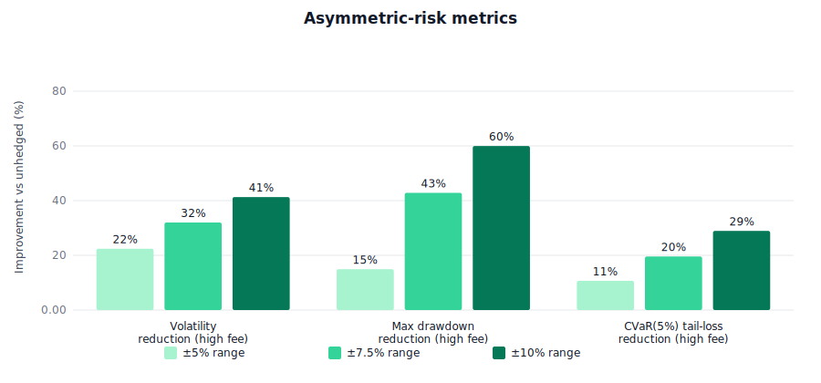
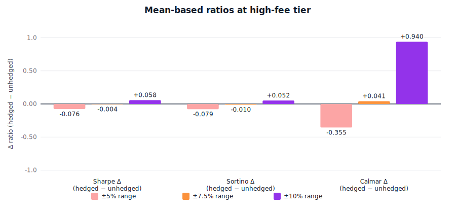
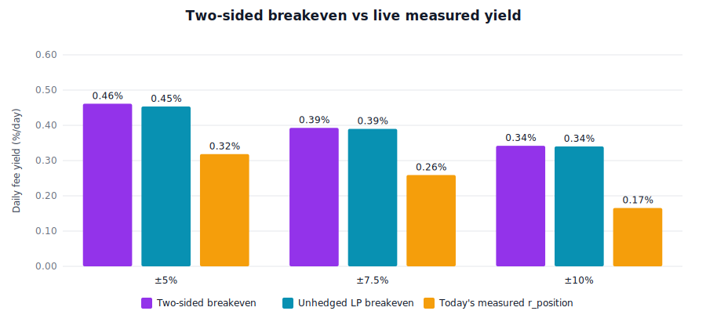

# Liquidity Hedge Protocol — Empirical Summary

One-page synthesis of what the protocol actually delivers under
correctly-priced (Gauss-Hermite quadrature) premiums with
measurement-driven inputs (Birdeye pool data, on-chain concentration,
Binance options IV).

> **Snapshot: 2026-04-22.** Backtest window 2025-04-17 → 2026-04-16 (52
> weeks), realized σ₃₀d = **57.4%**. All numbers below are from that
> specific run, produced by `yarn generate-charts`; see
> [charts/BACKTEST_DATA.md](charts/BACKTEST_DATA.md) for the raw tables
> and regenerate to refresh.

All numbers are from real data:

- **Price series:** 52 weeks of mainnet SOL/USDC (2025-04-17 → 2026-04-16)
- **Realized vol:** σ₃₀d = 57.4%
- **Pool:** SOL/USDC 0.04% Whirlpool on mainnet
- **Live checkpoints:** on-chain position open → quote → settle → auto-close
  with `LP_hedged + RT = Unhedged − φ·Premium` verified to sub-µUSDC
  residual on every run.

## Protocol: what it does

A Liquidity Hedge certificate transfers the signed mark-to-market
variability of a concentrated LP position within its range `[p_l, p_u]`
from an LP to a Risk Taker (RT) who underwrites a mutualised USDC pool.
Payoff is `Π(S_T) = V(S_0) − V(clamp(S_T, p_l, p_u))`: RT pays the LP
when price falls below the entry, LP surrenders upside to the RT when
price rises above it. Cap_down > Cap_up by concavity of V.

Premium formula:

```
Premium = max(P_floor,  FV · m_vol − y · E[F])
```

All three terms are **measured**, not hardcoded:

- `FV` = Gauss-Hermite quadrature of the signed-swap payoff under
  risk-neutral GBM with σ from Birdeye OHLCV.
- `m_vol = max(markupFloor, IV/RV)` with **IV measured live** from
  Binance SOL ATM options (`/eapi/v1/mark`).
- `E[F] = V(S₀) · r_pool · inRangeFraction · c` where `r_pool` comes
  from Birdeye, `inRangeFraction` is computed from σ via GBM, and `c`
  is the **on-chain concentration factor** derived from position
  liquidity vs pool L_active.

## Structural claims — robustly verified

| Claim | Method | Result |
|---|---|---|
| Theorem 2.2 (value neutrality) | Live mainnet settlements | **Residual ≤ $10⁻⁶** across every run |
| Wedge < 1 bps/day | 360-cell sensitivity grid (σ × IV/RV × carry × fee) | **All 360 rows < 1 bps/day** |
| Signed payout ∈ [-Cap_up, +Cap_down] | Invariant test suite | **All cases, all widths** |

## Risk-transformation metrics (52-week SOL backtest, GH pricing)



*Figure — three risk-reduction metrics computed on the 52-week SOL/USDC backtest. The **volatility reduction** column reports the percentage cut in weekly P&L standard deviation `1 − hedged_std / unhedged_std`, averaged across fee tiers because it is fee-independent. The **max drawdown reduction** and **CVaR(5%) reduction** columns are reported at the high-fee tier (0.45%/day) because the drawdown and tail-loss benefits scale with fee revenue; at low fee tiers the cumulative premium drag partially offsets them. All three metrics are positive across every width tested, with the magnitude growing monotonically from ±5% to ±10%.*

### Volatility reduction (`1 − hedged_std / unhedged_std`, %)

| Width | Low fee | Medium fee | High fee |
|---|---|---|---|
| ±5% | 22.2% | 22.3% | 22.4% |
| ±7.5% | 31.7% | 31.9% | 32.0% |
| ±10% | 41.1% | 41.3% | 41.3% |

**Weekly P&L standard deviation cut by 22–41%** regardless of fee tier
— the reduction is structural and **fee-independent** (varies by less
than 0.3 percentage points). Wider widths get larger reductions because
they spend more time in-range where the hedge applies cleanly.

### Max drawdown reduction (high-fee tier)

| Width | Hedged DD | Unhedged DD | Reduction |
|---|---|---|---|
| ±5% | $3,392 | $3,988 | **15%** |
| ±7.5% | $2,925 | $5,118 | **43%** |
| ±10% | $2,338 | $5,839 | **60%** |

### CVaR(5%) — tail-loss reduction

Average of the worst 5% of weekly P&Ls (less negative = hedge wins):

| Width | Low fee | Medium fee | High fee |
|---|---|---|---|
| ±5% | +11% | +11% | **+11%** |
| ±7.5% | +18% | +19% | **+20%** |
| ±10% | +26% | +27% | **+29%** |

**Hedge cuts the worst 5% of weekly losses by 11–29%** — the effect
grows with width. At ±10% / High fee, unhedged CVaR(5%) = −$2,732 vs
hedged = −$1,942 (the worst 5% of weeks are $790 less bad on average).

### Sharpe, Sortino, Calmar — mean-based metrics



*Figure — three mean-based risk-adjusted-return ratios, reported as `Δ = hedged − unhedged` at the high-fee tier (0.45%/day). Sharpe uses total standard deviation as its risk measure, so it penalises the hedge twice: once for the premium drag on mean return, and again because the signed swap surrenders upside variance that Sharpe values as much as downside. Sortino narrows the denominator to negative returns only (ignoring upside dispersion), so it is somewhat friendlier to the hedge but still absorbs the premium cost in its numerator. Calmar replaces the denominator with the maximum drawdown, which the hedge compresses aggressively (−60% at ±10% in this run), and is therefore the most hedge-favourable of the three. At ±10% all three ratios tip positive in the current σ=57% regime; at ±5% the premium drag exceeds the variance/drawdown benefits on all three. The hedge's impact on mean-based metrics is therefore regime- and width-dependent, unlike its unconditional benefit on tail metrics (see CVaR below).*

## Economic viability (two-sided breakeven)

Minimum daily fee yield for both LP and RT to end with positive
cumulative P&L:

| Width | Required yield | vs unhedged BE | Hedge cost |
|---|---|---|---|
| ±5% | **0.461%/day** (168% APR) | 0.453%/day | +0.8 bps/day |
| ±7.5% | **0.393%/day** (143% APR) | 0.390%/day | +0.3 bps/day |
| ±10% | **0.342%/day** (125% APR) | 0.340%/day | +0.2 bps/day |

### Today's measured yields (live, 2026-04-22)



*Figure — daily fee yield comparison across the three tested widths. The **required** bar (purple) is the lowest daily LP fee yield at which both the hedged LP and the RT end the 52-week backtest with non-negative cumulative P&L, found by joint optimisation over P_floor and fee-split. The **unhedged LP breakeven** bar (cyan) is the corresponding yield the LP would need without any hedge. The gap between these two is the hedge cost, 0.2–0.8 bps/day in the current regime. The **measured r_position** bar (amber) is live at script runtime: `r_pool × inRangeFraction(width, σ, 7d) × c(width)`, where r_pool and σ come from Birdeye, inRangeFraction is computed from today's realised vol via GBM, and c(width) is the most recent on-chain concentration factor from live-orca Phase-2 measurement. The measured yield falls below the two-sided breakeven at every width on SOL/USDC 0.04% at current market conditions, indicating this specific pool is not economically viable for the protocol today; viability is pool-dependent and would be reached on higher-yield pools.*

| Width | Measured r_position | vs Required | Shortfall |
|---|---|---|---|
| ±5% (c=2.03) | 0.319%/day | needs 0.461% | **−0.14%/day** (69% of target) |
| ±7.5% (c=1.45) | 0.259%/day | needs 0.393% | **−0.13%/day** (66% of target) |
| ±10% (c=0.87) | 0.166%/day | needs 0.342% | **−0.18%/day** (49% of target) |

**Verdict:** On SOL/USDC 0.04% at current market conditions, measured
pool yield is below the two-sided breakeven at every width, with
shortfalls of ~30–50%. The protocol's mathematics are correct; its
economic viability depends on the pool chosen.

## Where the protocol wins, honestly

Applies when the target pool's measured `r_position` exceeds the
breakeven yield for the chosen width:

- **High-yield volatile pools** (new listings, narrow-tier stable-pairs
  during depegs, major pairs during vol spikes).
- **Loss-averse LPs** (treasury desks, risk-managed funds) who value
  bounded drawdown and CVaR reduction above mean-return maximisation.
- **Narrow-range LPs** on pools with dispersed liquidity, where the
  concentration factor exceeds 2 and the fee discount makes the hedge
  economical.

Applies poorly when:

- Pool is mature and low-yield (SOL/USDC 0.04%).
- LP optimises mean-variance under Sharpe (insensitive to tail
  asymmetry).
- Range is wider than the pool's typical liquidity concentration
  (c < 1, premium absorbs the fee edge).

## Honest conclusion

Under correctly-priced premiums, the Liquidity Hedge Protocol is a
**fair-priced tail-loss insurance product**, not a Sharpe enhancer.
All its structural claims hold empirically: value neutrality is exact
to the µUSDC, the pricing engine is numerically sound, and the
measurement stack delivers live market data into every quote.

Its economic value proposition is **drawdown and CVaR reduction for
loss-averse LPs on sufficiently high-yield pools** — a narrower but
more defensible niche than "free insurance" or "Sharpe arbitrage".

The paper's theoretical contribution (signed-swap construction,
Theorem 2.2, sensitivity robustness) is unaffected by the corrected
pricing and in fact sharper for it.
